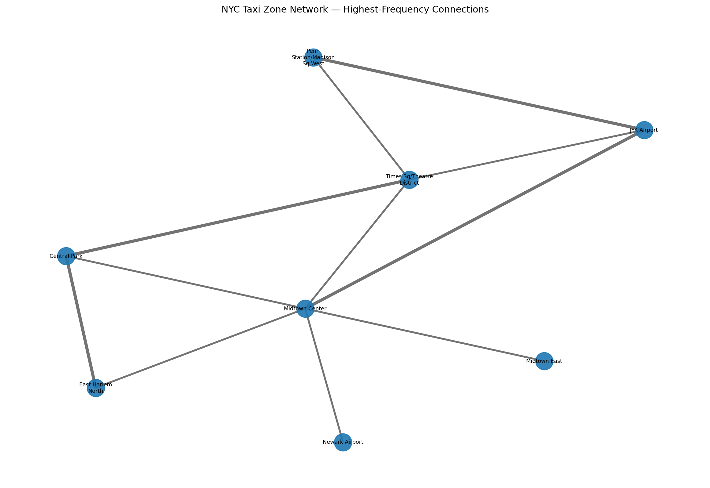

# NYC Taxi Algorithms Analysis

Group academic project developed as part of an **Algorithms** course during the first year of my Bachelor's degree.

The project applies **data analysis, sorting algorithms and graph theory** to NYC taxi trip data using Python. It combines descriptive statistics, custom algorithm implementation, performance benchmarking and network modelling in a reproducible workflow.

---

## Project Overview

The analysis works with NYC TLC-style taxi trip records containing information such as:

- pickup and drop-off timestamps;
- passenger count;
- trip distance;
- pickup and drop-off zone IDs;
- fare amount;
- tip amount;
- total amount.

The project focuses on three main areas:

1. **Descriptive analysis** of taxi trips;
2. **Implementation and comparison of sorting algorithms**;
3. **Graph modelling** of connections between taxi zones.

A small synthetic demo dataset is included so the repository can be run immediately without redistributing the original course dataset.

---

## Key Features

- Loading and validation of NYC TLC-style trip data
- Descriptive statistics for passenger counts, fares, tips and total amounts
- Calculation of average trip speed in **km/h**
- Pickup-frequency analysis for selected taxi zones
- **Bubble Sort, Merge Sort and Quick Sort implemented from scratch**
- Benchmarking of custom sorting algorithms
- Automatic correctness checks against Python's built-in sorting
- Weighted taxi-zone network built with **NetworkX**
- Network visualisation with **Matplotlib**
- JSON export of analysis results
- Automated unit tests for the sorting algorithms

---

## Sorting Algorithms

The project implements three classic sorting algorithms directly in Python.

| Algorithm | Typical Time Complexity | Main Idea |
|---|---:|---|
| Bubble Sort | O(n²) | Repeatedly swaps adjacent out-of-order values |
| Merge Sort | O(n log n) | Divide-and-conquer followed by ordered merging |
| Quick Sort | O(n log n) average | Partitions values around a pivot |

Each algorithm is benchmarked on the same input data and its output is checked against Python's built-in `sorted()` function.

The benchmark can be applied to variables including:

- passenger count;
- fare amount;
- tip amount;
- total amount;
- trip speed.

---

## Taxi-Zone Network

Pickup and drop-off locations are represented as **nodes**, while observed taxi trips create **weighted edges** between zones.

Repeated trips between the same pair of zones increase the corresponding edge weight.

The project uses an **undirected weighted graph**, consistent with the original assignment objective.



The visualisation focuses on the strongest observed connections so that the network remains readable.

---

## Data Analysis

The descriptive component computes:

- minimum, maximum and average passenger count;
- minimum, maximum and average fare amount;
- minimum, maximum and average tip amount;
- minimum, maximum and average total amount;
- minimum, maximum and average trip speed;
- trip counts originating from selected taxi zones.

Trip speed is calculated from trip distance and elapsed travel time, with distance converted from miles to kilometres.

---

## Technologies

**Python** · **NetworkX** · **Matplotlib** · **CSV / structured data processing** · **unittest**

---

## Repository Structure

```text
nyc-taxi-algorithms-analysis/
├── README.md
├── run_analysis.py
├── requirements.txt
├── .gitignore
│
├── data/
│   ├── README.md
│   ├── sample_taxi_trips.csv
│   └── sample_zone_lookup.csv
│
├── src/
│   ├── __init__.py
│   ├── data_processing.py
│   ├── sorting_algorithms.py
│   ├── graph_analysis.py
│   └── main.py
│
├── tests/
│   ├── __init__.py
│   └── test_algorithms.py
│
└── outputs/
    ├── analysis_summary.json
    └── taxi_zone_network.png
```

---

## Running the Project

### 1. Install dependencies

```bash
pip install -r requirements.txt
```

### 2. Run the included demo

```bash
python run_analysis.py
```

The script prints the main results and generates:

```text
outputs/analysis_summary.json
outputs/taxi_zone_network.png
```

### 3. Run the tests

```bash
python -m unittest discover -s tests -v
```

### 4. Use another NYC TLC-style dataset

```bash
python run_analysis.py \
  --trips path/to/trips.csv \
  --zones path/to/taxi_zone_lookup.csv \
  --benchmark-size 2000
```

`--benchmark-size` limits the number of observations used for the sorting benchmark because Bubble Sort becomes computationally expensive on large inputs.

---

## Expected Data Structure

The trip dataset should contain the following columns:

```text
tpep_pickup_datetime
tpep_dropoff_datetime
passenger_count
trip_distance
PULocationID
DOLocationID
fare_amount
tip_amount
total_amount
```

The zone lookup should contain at least:

```text
LocationID
Zone
```

Additional columns can be present and are ignored by the analysis.

---

## Main Outputs

The project produces:

- descriptive trip statistics;
- pickup-zone frequency counts;
- execution-time benchmarks for the three sorting algorithms;
- automatic sorting-correctness checks;
- taxi-zone graph statistics;
- weighted network visualisation;
- a structured JSON summary of the analysis.

---

## Academic Context

This project was developed as a **group academic project** for an Algorithms course during the first year of my Bachelor's degree.

It provided practical experience with **algorithm implementation, complexity, benchmarking, data processing and introductory graph analysis**.

---

## Limitations

- The included demo dataset is synthetic and is intended only to make the repository reproducible.
- Bubble Sort is intentionally inefficient for large datasets and should only be benchmarked on limited samples.
- The taxi-zone graph is represented as undirected, so trip direction is not captured.
- The network visualisation prioritises readability and therefore focuses on the strongest connections.
